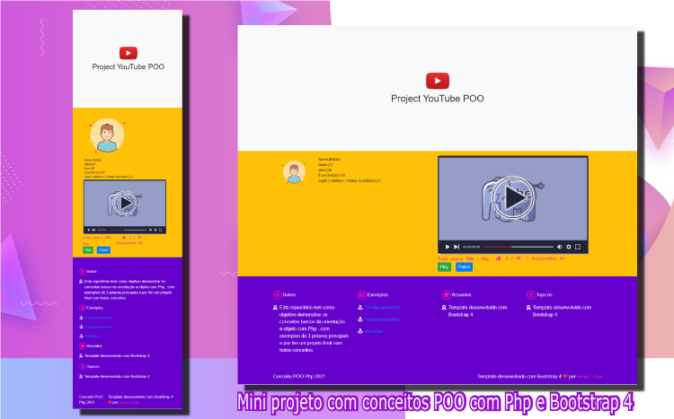
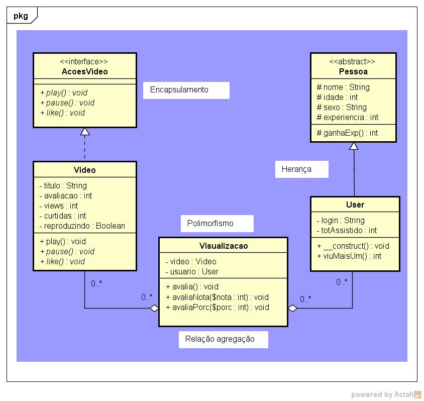

## Desenvolvimento de conceitos de programação orientada a objeto Php

### Neste projeto serão vistos os 3 pilares principais da POO (Sintaxe Básica Tipos Variáveis Constantes Expressões Operadores Estruturas de Controle Funções Classes e Objetos) e exercícios

- [Encapsulamento](#).
- [Relacionamento](#).
- [Herança](#).
- [Polimorfismo](#).
- [HTML](#).
- [CSS](#).
- [Bootstrap 4](#).

### Mini projeto final com todos conceitos

### Diagrama de classes

## Pilares da POO

## Encapsulamento
**Encapsulamento** gera <code>proteção de acesso</code> aos objetos, com <code>atributos (-) privados ou (#) protegidos</code>, que nunca serão acessados de fora da classe, e uma <code>interface</code> bem bem definida.

## Herança
A **herança** permite que criamos novas classes que irão herdar <code>caracteristicas e comportamento</code> da classe mãe. <code>class user extend pessoa</code>

## Polimorfismo
O polimorfismo permite que um metodo tenha varios comportamentos diferentes. A assinatura dos <code>métodos devem ser iguais e seus parametros</code>, mas seu <code>comportamento e retorno podem ser diferentes.

### Tipos de polimorfismo
- **Sobreposição** É um dos **polimorfismos** mais utilizados e acontece quando substituimos um metodo da classe mãe usando a mesma assinatura de metodo.
### Sobrecarga
- O polimorfismo de **sobrecarga** é menos utilizado e é uma forma de reescrever uma assinatura de metodo nas mesma classe, mas seus parametros são diferentes. Em Php a sobreCarga não existe, o que existe são possiveis gambiaras ou soluções mais complexas. Uma solução é mudar o nome do metodo para tentar realizar a sobreCarga.

